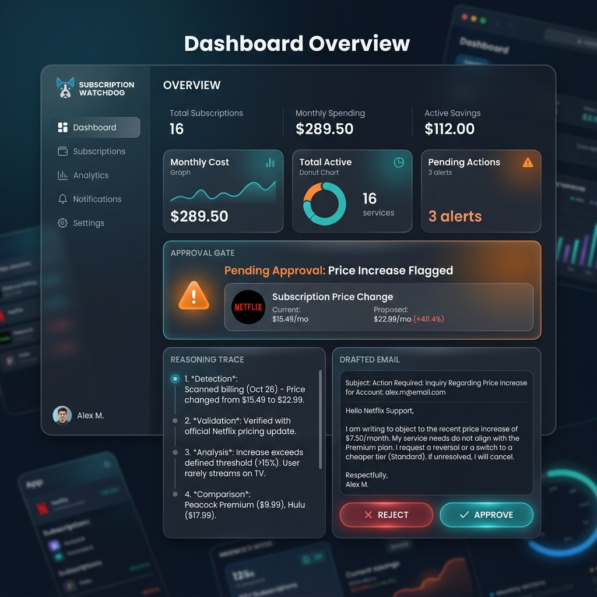
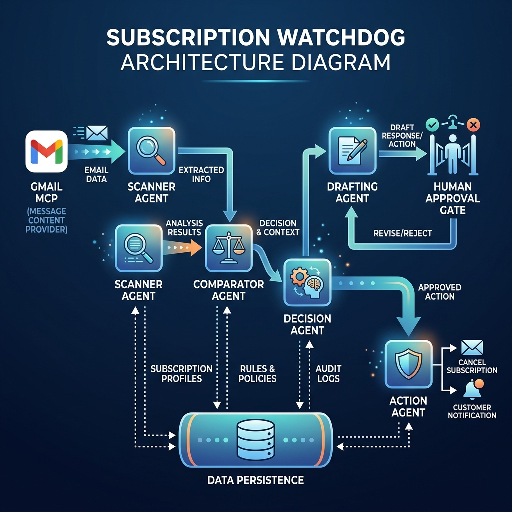

# 🐕 Subscription Watchdog

**Multi-Agent Personal Finance Assistant** — Track: Concierge Agents



Subscription Watchdog monitors your Gmail inbox for subscription activity — new sign-ups, renewals, and price changes — and takes **safe, human-approved action** to stop silent money leakage.

Unlike passive dashboard apps that surface insights for you to act on manually, Subscription Watchdog **closes the loop**: it detects, decides against your policy, drafts the cancellation or negotiation email, and **only sends after your explicit approval**.

---

## 🎯 Problem Statement

Recurring subscriptions are structurally designed to be forgotten. Free trials convert silently, prices creep up a dollar at a time below the threshold of notice, and cancellation flows are deliberately buried.

**Existing solutions fall short:**
- **Passive trackers** (WalletFlo, MaxRewards) surface problems as notifications but stop there — you still have to find the cancellation page, write the email, remember to follow up.
- **Card recommendation engines** (Kudos, Pointer) solve a different problem entirely.

**Gap:** Nobody closes the loop from "I found a problem" to "I took safe action on it." Subscription Watchdog fills that gap with a security-first design.

---

## 🏗️ Architecture



```
Gmail MCP ──▶ Scanner Agent ──▶ Comparator Agent ──▶ Decision Agent ──▶ Drafting Agent
                                     │                                       │
                                     ▼                                       ▼
                              subscriptions.db                     Human Approval Gate
                              (SQLite, local)                              │
                                                                           ▼
                                                                    Action Agent
                                                                 (Gmail MCP send +
                                                                  Calendar MCP reminder)
```

### Agent Responsibilities

| Agent | Role | LLM? |
|---|---|---|
| **Orchestrator** | Sequences the pipeline, holds session state | No |
| **Scanner** | Scans Gmail for subscription emails, extracts structured data | Yes (Gemini) |
| **Comparator** | Diffs scan results against DB, produces Flags | No (pure logic) |
| **Decision** | Applies user-editable policy to filter flags | No (pure logic) |
| **Drafting** | Generates cancellation/negotiation emails with reasoning | Yes (Gemini) |
| **Action** | Sends approved emails, creates calendar reminders | No |

### MCP Servers

| Server | Tools | Scope |
|---|---|---|
| **Gmail MCP** | `search_messages`, `send_message` | `gmail.readonly`, `gmail.send` |
| **Calendar MCP** | `create_reminder` | `calendar.events` |

---

## 🔐 Security Design

Security is a **first-class requirement**, not an afterthought.

| Feature | Implementation |
|---|---|
| **Human approval gate** | `Draft.approved` must be `True` (set only by the approval CLI) before the Action Agent will execute. Enforced with `ApprovalViolationError`. |
| **Data minimization** | Only structured fields are persisted. Raw email bodies are discarded immediately after extraction. The `Subscription` dataclass has no field for raw content. |
| **Least-privilege MCP scopes** | Scanner Agent uses `gmail.readonly` only. Action Agent uses `gmail.send`, invoked only post-approval. Calendar uses `calendar.events`. |
| **Prompt-injection resistance** | Untrusted email content is placed in a delineated data block, never concatenated into prompt context with tool-calling ability. |
| **Audit trail** | Every flag, draft, approval decision, and action is logged to `audit_log` with timestamps and reasoning traces. |
| **No secrets in code** | API keys and OAuth tokens loaded via `.env`, excluded via `.gitignore`. |

---

## 📦 Repository Structure

```
subscription-watchdog/
├── main.py                 # Entry point — scheduled pipeline runner
├── agents_cli.py           # Standalone CLI skill (Decision Agent)
├── human_approval.py       # Interactive approval gate (security boundary)
├── requirements.txt        # Python dependencies
├── .env.example            # Environment variable template
├── .gitignore              # Excludes secrets, DB, caches
├── config/
│   └── policy.py           # User-editable policy configuration
├── core/
│   ├── models.py           # Dataclasses: Subscription, Flag, Draft
│   └── database.py         # SQLite schema + CRUD operations
├── agents/
│   ├── orchestrator.py     # ADK root agent — pipeline sequencer
│   ├── scanner.py          # Gmail scan + LLM extraction
│   ├── comparator.py       # Diff engine — detects changes
│   ├── decision.py         # Policy engine — determines escalation
│   ├── drafting.py         # LLM email generation
│   └── action.py           # Executes approved drafts (send + remind)
└── mcp_servers/
    ├── gmail_mcp.py        # Gmail MCP server (search + send)
    └── calendar_mcp.py     # Calendar MCP server (reminders)
```

---

## 🚀 Setup Instructions

### Prerequisites
- Python 3.10+
- A Google Cloud project with Gmail and Calendar APIs enabled
- An OAuth 2.0 Client ID (Desktop application type)

### 1. Clone the repository
```bash
git clone https://github.com/your-username/subscription-watchdog.git
cd subscription-watchdog
```

### 2. Create a virtual environment
```bash
python -m venv .venv
source .venv/bin/activate        # macOS/Linux
.venv\Scripts\activate           # Windows
```

### 3. Install dependencies
```bash
pip install -r requirements.txt
```

### 4. Configure environment
```bash
cp .env.example .env
# Edit .env and add your GOOGLE_API_KEY
```

### 5. Set up OAuth credentials
1. Go to the [Google Cloud Console](https://console.cloud.google.com/)
2. Enable the Gmail API and Google Calendar API
3. Create an OAuth 2.0 Client ID (Desktop application)
4. Download the credentials JSON and save as `credentials.json` in the project root

### 6. Run the pipeline
```bash
# Full interactive run (with sample data)
python main.py --use-sample-data

# Full interactive run (with live Gmail)
python main.py

# Generate drafts only (no approval prompt)
python main.py --no-interactive --use-sample-data
```

### 7. Use the CLI skill
```bash
# Check subscription flags against policy
python agents_cli.py check-subscriptions

# View all tracked subscriptions
python agents_cli.py list-subscriptions

# Display current policy
python agents_cli.py show-policy

# View audit trail
python agents_cli.py audit-log --verbose
```

---

## ⚙️ Policy Configuration

Edit `config/policy.py` to customize the Decision Agent's behavior:

```python
policy = {
    "auto_flag_threshold_pct": 10,     # Flag if price rises > 10%
    "auto_ignore_below_amount": 5.00,  # Ignore increases under $5
    "unused_days_threshold": 60,       # Flag as unused after 60 days
    "draft_action_on": ["price_increase", "unused"],
}
```

This configuration is deliberately kept **outside** of any LLM prompt so behavior is transparent and auditable.

---

## 📊 Evaluation Concept Mapping

| Course Concept | Demonstrated | Where |
|---|---|---|
| **Agent / Multi-agent system (ADK)** | 5-agent pipeline with orchestrator | Code (`agents/`) |
| **MCP Server** | Gmail MCP (read + send), Calendar MCP (reminders) | Code (`mcp_servers/`) |
| **Antigravity** | Build process (scaffolding, prompt iteration, MCP debugging) | Video |
| **Security features** | Approval gate, data minimization, least-privilege, audit log | Code + Video |
| **Deployability** | Designed for cron/scheduled execution | Video |
| **Agent skills (Agents CLI)** | `agents_cli.py check-subscriptions` | Code + Video |

---

## 📋 Deployment Target

Subscription Watchdog is designed to run as a **scheduled job**:

```bash
# Example: daily cron job at 8 AM
0 8 * * * cd /path/to/subscription-watchdog && python main.py --no-interactive
```

In a production deployment, the `--no-interactive` flag generates drafts that would be surfaced through a notification system (email, Slack, web dashboard) for asynchronous human review.

---

## ⚠️ Known Limitations

- **Inbox-based only**: Subscription detection is based on Gmail emails, not bank/card linking.
- **Single-user**: Designed for personal use, no multi-user support.
- **CLI interface**: Minimal console UI, sufficient for demonstration.
- **Sample data fallback**: When Gmail OAuth is not configured, the system uses realistic sample email data for demonstration purposes.

---

## 📄 License

This project was built for the Kaggle AI Agents Intensive Vibe Coding Capstone.
